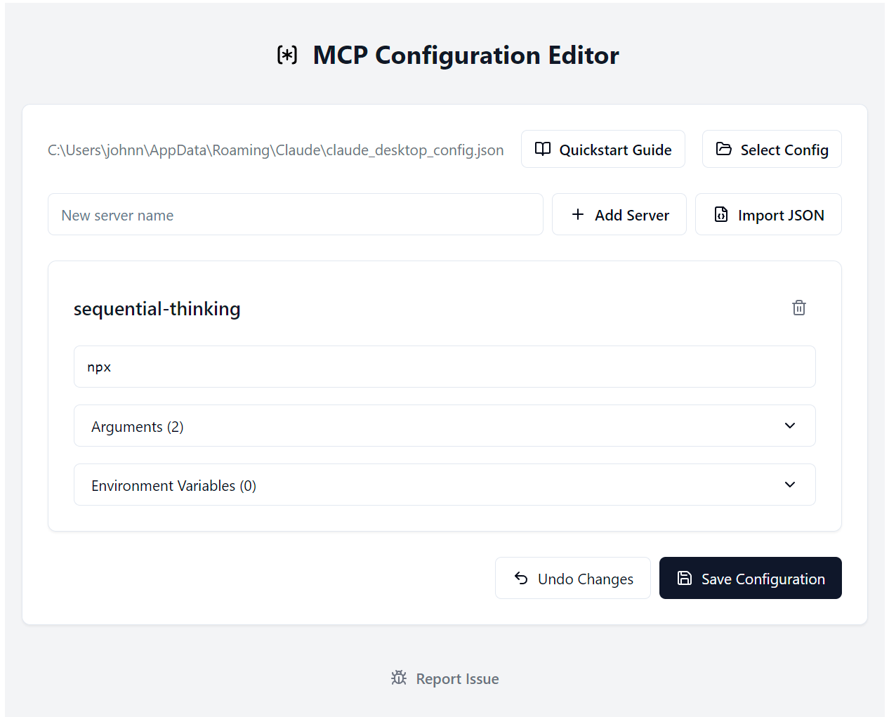

# MCP Config Editor

[](CHANGELOG.md)
[](LICENSE)

A desktop application for managing Model Context Protocol (MCP) server configurations. This tool provides a user-friendly interface for editing and managing MCP server settings, making it easier to work with AI models that support the Model Context Protocol.



## Features

- Get less angry with JSON!
- Experiment with more servers!
- Have more fun with MCP!

## Installation

```bash
# Clone the repository
git clone https://github.com/yourusername/mcp-config-editor.git

# Navigate to the project directory
cd mcp-config-editor

# Install dependencies
npm install

# Start the development server
npm run dev
```

## Usage

1. Launch the application
2. Add or edit MCP server configurations
3. Set environment variables for your servers
4. Save and manage your configurations
5. Import/Export configurations as needed

## Development

This project uses:
- [Electron](https://www.electronjs.org/) for the desktop application
- [React](https://reactjs.org/) for the UI framework
- [TypeScript](https://www.typescriptlang.org/) for type safety
- [Vite](https://vitejs.dev/) for build tooling
- [Radix UI](https://www.radix-ui.com/) for UI components
- [Tailwind CSS](https://tailwindcss.com/) for styling

## Contributing

We welcome contributions! Please see our [Contributing Guide](CONTRIBUTING.md) for details.

## License

This project is licensed under the MIT License - see the [LICENSE](LICENSE) file for details.

## Changelog

See [CHANGELOG.md](CHANGELOG.md) for a list of changes and version history.
